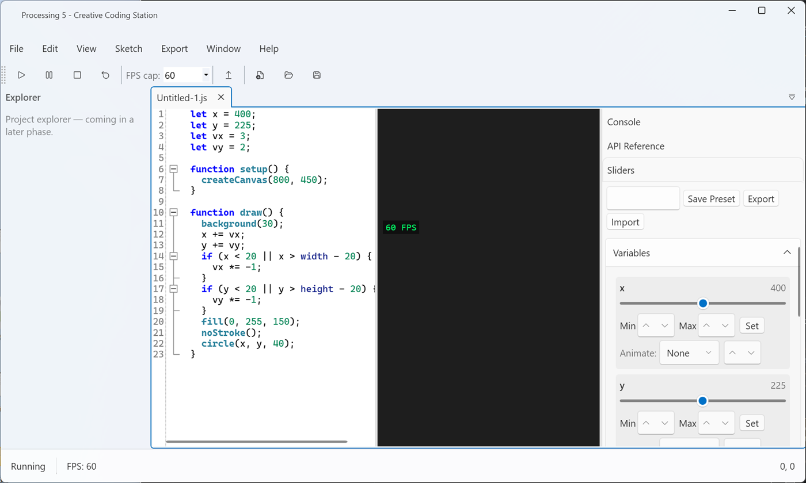
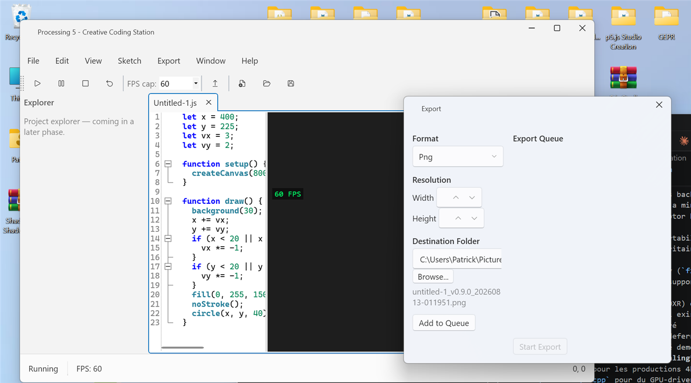

# Processing 5 - Creative Coding Station

[](https://github.com/Patrickjaillet/p5ccs/actions/workflows/ci.yml)
[](LICENSE)
[](docs/CHANGELOG.md)

A native Windows creative-coding IDE for [p5.js](https://p5js.org/), built with
C# / WPF / WPF-UI. Offline-first: the p5.js runtime, the code editor, and the
export pipeline all run locally with zero network dependency.

## Features

> Under active development — see [docs/CHANGELOG.md](docs/CHANGELOG.md) for
> the full release history.

- Fluent-themed WPF-UI interface (Mica/Acrylic, light/dark/system)
- Embedded WebView2 viewport, offline (p5.js and p5.sound vendored locally,
  served over a loopback-only local HTTP server — no CDN, no network calls)
- Full-featured AvalonEdit code editor with p5.js-aware syntax highlighting,
  folding, autocomplete, and inline error markers
- Intelligent slider system: live numeric-literal-to-UI binding, with
  presets and per-slider animation
- Full p5.js API coverage (2D, WEBGL, Sound, `p5.Vector`/`p5.Table`, custom
  GLSL shaders, DOM) plus a searchable offline API reference panel
- Deterministic video/GIF/image export pipeline (WebM, MP4, GIF, PNG/JPEG),
  with GPU-accelerated encoding where available and automatic CPU fallback

## Screenshots




## Getting Started

See [docs/COMPILATION.md](docs/COMPILATION.md) for build prerequisites and
instructions.

```powershell
dotnet build P5CCS.sln --configuration Release -p:Platform=x64
```

## Installation

Windows installers (x64 and native ARM64) are built with Inno Setup 7 from
[`installers/windows/setup.iss`](installers/windows/setup.iss) — see
[docs/COMPILATION.md](docs/COMPILATION.md#building-the-windows-installer).
Prebuilt installers are published on the
[Releases](https://github.com/Patrickjaillet/p5ccs/releases) page.

## Contributing

Contributions are welcome — see [CONTRIBUTING.md](CONTRIBUTING.md) and our
[Code of Conduct](CODE_OF_CONDUCT.md).

## License

**Processing 5 - Creative Coding Station** is licensed under the [MIT License](LICENSE).
Copyright © 2026 Patrick JAILLET.

This project embeds [p5.js](https://p5js.org/) and its Sound addon
(Copyright © 2026 Processing Foundation, LGPL-2.1) and
[FFmpeg](https://ffmpeg.org/) (LGPL-3.0). See
[docs/THIRD-PARTY-NOTICES.md](docs/THIRD-PARTY-NOTICES.md) for the full list
of third-party components and their licenses.

## Links

- Website: https://patrickjaillet.github.io/p5ccs
- Repository: https://github.com/Patrickjaillet/p5ccs
- Contact: sandefjord.development@proton.me
